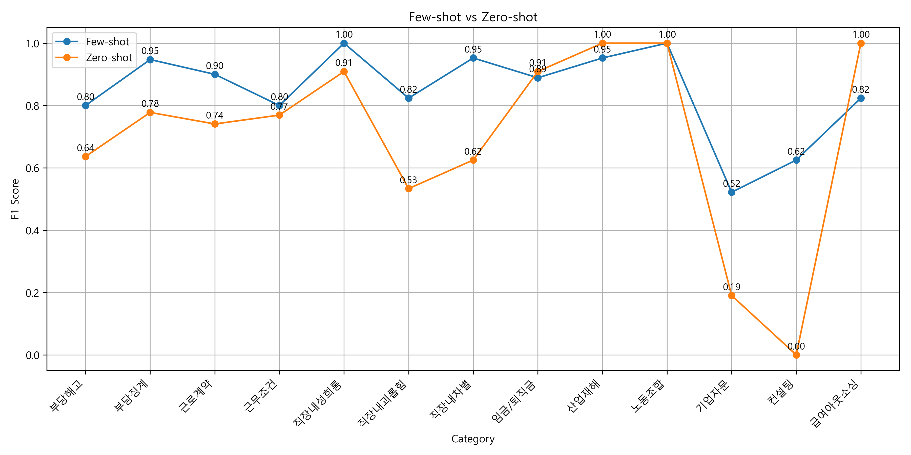
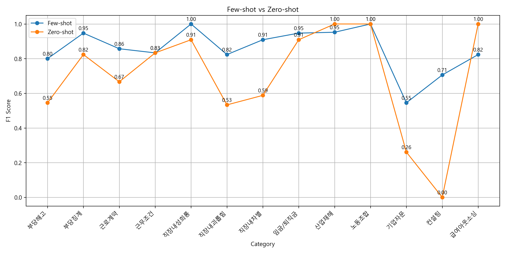
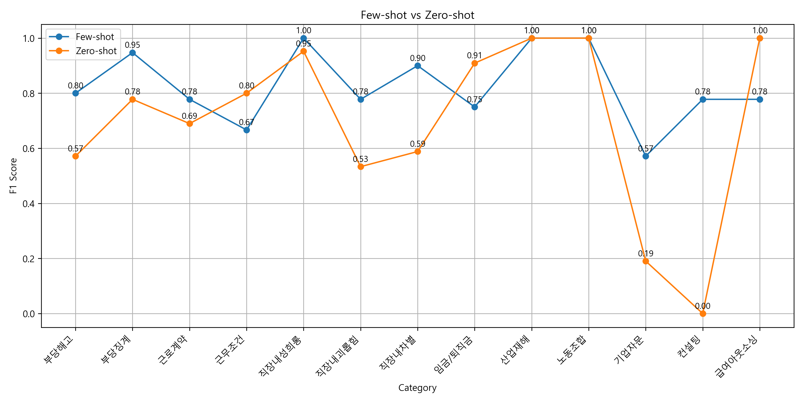

# ▶ Few-shot Prompting 기반 노동문제 분류 실험

## 1. 실험 개요
- 사용자 자연어 입력을 기반으로 GPT가 노동 문제 유형을 분류하는 AI 분류기 구현
- Zero-shot보다 높은 분류 정확도를 위해 **Few-shot Prompting** 기법을 적용
- 문체 유형(business / worker / casual) 및 복합 쟁점 구분을 고려한 프롬프트 구성
- 예시 문장 튜닝 및 키워드 매칭을 통한 정밀도 향상

---

## 2. 실험 조건

| 항목 | 내용 |
|------|------|
| 대상 카테고리 | 부당해고, 부당징계, 근로계약, 근무조건, 직장내성희롱, 직장내괴롭힘, 직장내차별, 임금/퇴직금, 산업재해, 노동조합, 기업자문, 컨설팅, 급여아웃소싱 (총 13개) |
| 모델 | OpenAI GPT 기반 |
| 방식 | Zero-shot vs Few-shot Prompt 비교 |
| 평가 지표 | Accuracy, Macro F1 Score, Category별 F1 Score |

---
## 3. Prompt 구조 예시

```
당신은 한국의 노동문제를 분류하는 AI 어시스턴트입니다.  
아래 문장은 실제 사용자 질문이며, 가장 적절한 카테고리를 다음 중 하나로 선택하세요:

- 부당해고
- 부당징계
- 근로계약
- 근무조건
- 직장내성희롱
- 직장내괴롭힘
- 직장내차별
- 임금/퇴직금
- 산업재해
- 노동조합
- 기업자문
- 컨설팅
- 급여아웃소싱

규칙: 반드시 위 카테고리 중 하나만 출력하세요.
```
---

## 4. 실험 방식

- 문체별로 문장 구분: business / worker / casual
- 총 130문장 대상 테스트
- 각 단계마다 Prompt 정제 + 예시 보완 + 키워드 기반 규칙 추가
- 핵심 오답 중심으로 Few-shot 예시를 갱신하며 성능 개선

---

## 5. 모델 성능 비교

| 버전 | Accuracy | Macro F1 | 주요 개선점 |
|------|----------|----------|--------------|
| Zero-shot | 70.6% | 65.2% | 기본 시스템 |
| Few-shot 1차 | 74.1% | 72.6% | 문장 예시 8개 추가 |
| Few-shot 2차 | 84.7% | 83.4% | 핵심 오답 카테고리 키워드 매핑 적용 |
| Few-shot 3차 | 85.9% | 86.2% | 카테고리별 키워드 매핑 범위 확장 |
| Few-shot 4차 | **89.4%** | **88.9%** | 주요 오답 패턴 기반 프롬프트 정제 |

---

## 6. 실험 결과 비교 (Zero-shot vs Few-shot)

### 🔹 **final_test_1차**  


### 🔹 **final_test_2차**  


### 🔹 **final_test_3차**  


> 대부분의 카테고리에서 Few-shot 방식이 Zero-shot보다 더 높은 F1 Score를 기록하였으며,  
> 특히 `기업자문`, `컨설팅`과 같은 구분이 어려운 항목에서 **뚜렷한 성능 차이**를 보였습니다.

---

## 7. 기술 포인트

- 사용자 문장에서 핵심 키워드를 추출하고, Few-shot 예시와 함께 GPT에게 분류 요청
- 예: `'산업재해' vs '출퇴근 재해'`처럼 유사한 이슈를 구별하여 **적합한 키워드 우선 추천**
- 프롬프트 설계에는 역할 설정, 명확한 출력 지시, 예시 문장 튜닝 전략이 포함됨

---

## 📁 관련 파일

- `classifier.py`: GPT 기반 분류기
- `evaluate_classification.py`: Accuracy, Macro F1 Score, Category별 F1 Score 계산 스크립트
- 'final_test.py' : 최종 TEST 스크립트
- `test_set.json`: 최종 TEST용 Few-shot 예시 데이터
- 📄 [결과 보고서 보기](./[NOMAD]Few_shot_experiments.pdf)

---

